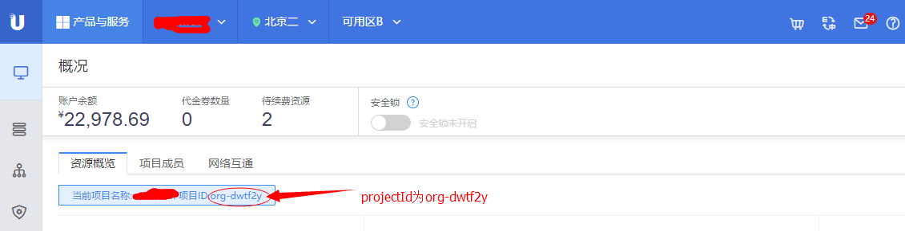
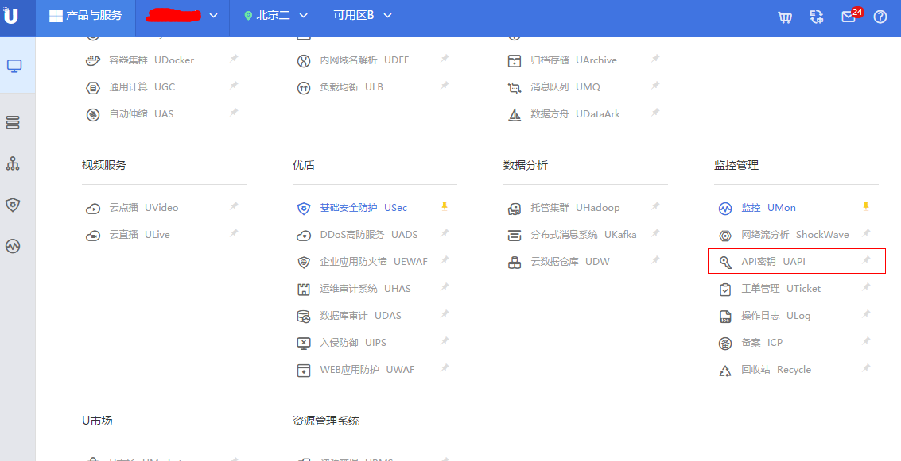

# UMQ Java SDK 使用指南

## 1.配置http client

### 配置client

Method: createClient

params

|      Name      |  Type   | Description | Required |
| :------------ | :----- | :--------- | :------ |
|    host        | String  |   服务地址   |   Yes    |
|    region     | String  |   地域   |   Yes    |
|  publicKey   | String  |    用户公钥    |   Yes    |
| privateKey | String  |  用户私钥  |   Yes    |
|    account     | String  |   登陆控制台的邮箱  |   Yes    |
|   projectId     | String  | 项目Id |   Yes    |

host, region 获取方法:

请参照下表填写host与region的值:

| 地域 | region | 内网host | 外网host |
| :--- | :----- | :------ | :------ |
| 北京二| cn-bj2 | air.bj2.umq.service.ucloud.cn:6318 | umq-bj2.service.ucloud.cn:6328 |
| 广东 | cn-gd | mars.gd.umq.service.ucloud.cn:6318 | 暂未部署 |
| 香港 | hk | pacific.gd.umq.service.ucloud.cn:6318 | 暂未部署 |

内网host只能从UCloud的云主机上发起访问;外网host可以从公网发起访问.

projectId 获取办法:

如下图所示，从控制台上获取.

publicKey, privateKey 获取方法:

如下图所示，从控制台上API密钥页面获取.

## 2.操作queue

### 创建队列

Method: createQueue

Params

|   Name    |  Type   |               Description                | Required |
| :------- | :----- | :-------------------------------------- | :------ |
| couponId  | String  |                  优惠券Id。如果没有优惠券，改值赋值为null |    Yes    |
|  remark   | String  |                  业务组描述                   |    Yes    |
| queueName | String  |                业务组信息/队列名                 |   Yes    |
| pushType  | String |      发送方式。枚举值:"Direct", 直接推送; "Fanout", 广播推送      |   Yes    |
|    qos    | String  | 是否需要对消费进行服务质量管控。枚举值为: "Yes",表示消费消息时客户端需要确认消息已收到(Ack模式)；"No",表示消费消息时不需要确认(NoAck模式). |    Yes    |

Return

|  Name   |  Type   |      Description       |
| :----- | :----- | :-------------------- |
| queueId|  String  | 生成的queue id |

Throws

当发生错误时，会抛出异常ServerResponseException

### 删除队列

Method: deleteQueue

Parameters

|   Name    |  Type   | Description | Required |
| :------- | :----- | :--------- | :------ |
| queueId |  String  |    队列Id     |   Yes    |

Return

|  Name   |  Type   |      Description       |
| :----- | :----- | :-------------------- |
| queueId |  String  | 删除的queue的Id |

Throws

当发生错误时，会抛出异常ServerResponseException

### 展示队列

Method: listQueue

Params

|   Name    |  Type   | Description | Required |
| :------- | :----- | :--------- | :------ |
| limit |  int  |   数量     |   Yes    |
| offset |  int  |   偏移量     |   Yes    |

Return

|  Name   |  Type   |      Description       |
| :----- | :----- | :-------------------- |
| queueInfo |  List<Queue> |     队列信息            |

Throws

当发生错误时，会抛出异常ServerResponseException

Queue

|  Name   |  Type   |      Description       |
| :----- | :----- | :-------------------- |
| QueueId |  String |       队列ID            |
| QueueName |  String |       队列名称           |
| PushType |  String |       推送类型           |
| MsgTtl |  Int |       消息失效时间            |
| CreateTime |  Int |       队列建立时间            |
| HttpAddr |  String |       队列http地址           |
| QoS |  String |       队列服务质量管控信息           |
| Publishers |  List(Role) |       生产者列表           |
| Consumers|  List(Role) |       消费者列表            |

Role

|  Name   |  Type   |      Description       |
| :----- | :----- | :-------------------- |
| Id |  String |       角色ID            |
| Token |  String |       角色Token           |
| CreateTime |  Int |       创建时间           |

## 3.操作角色

### 创建生产者(Pub)，消费者(Sub)

Method: createRole

Params

|  Name   |  Type   |      Description       |
| :----- | :----- | :-------------------- |
| queueId |  String |       队列ID            |
| num |  Int|       数量           |
| role |  String |       角色。枚举值: "Sub", 消费者; "Pub", 生产者   |

Return

|  Name   |  Type   |      Description       |
| :----- | :----- | :-------------------- |
| Role |  Role |       角色信息           |

Throws

当发生错误时，会抛出异常ServerResponseException

### 删除角色

Method: deleteRole

Params

|  Name   |  Type   |      Description       |
| :----- | :----- | :-------------------- |
| queueId |  String |       队列ID            |
| roleId |  String|       角色ID           |
| role |  String |       角色           |

Return

|  Name   |  Type   |      Description       |
| :----- | :----- | :-------------------- |
| roleId |  String |       角色ID           |

Throws

当发生错误时，会抛出异常ServerResponseException

## 消息操作

### 推送消息

Method: publishMsg

Params

|  Name   |  Type   |      Description       |
| :----- | :----- | :-------------------- |
| queueId |  String|       队列ID           |
| publisherId |  String |       生产者ID          |
| publisherToken |  String |       生产者Token          |
| content |  String |       消息内容          |

Return

|  Name   |  Type   |      Description       |
| :----- | :----- | :-------------------- |
| isSuccessful |  boolean |       操作是否成功           |

Throws

当发生错误时，会抛出异常ServerResponseException

### 拉取消息

Method: getMsg

Params

|  Name   |  Type   |      Description       |
| :----- | :----- | :-------------------- |
| queueId |  String|       队列ID           |
| consumerId |  String |       生产者ID          |
| consumerToken |  String |       生产者Token          |

Return

|  Name   |  Type   |      Description       |
| :----- | :----- | :-------------------- |
| Msg |  Message  |       消息           |

Msg

|  Name   |  Type   |      Description       |
| :----- | :----- | :-------------------- |
| MsgId |  String|       消息ID           |
| MsgBody  |  String |       消息内容            |
| MsgTime |  Int |       消息传递时间           |

Throws

当发生错误时，会抛出异常ServerResponseException

### 回执消息

Method: AckMsg

Params

|  Name   |  Type   |      Description       |
| :----- | :----- | :-------------------- |
| queueId |  String|       队列ID           |
| consumerId |  String |   消费者者ID          |
| msgId |  String |       消息ID         |

Return

|  Name   |  Type   |      Description       |
| :----- | :----- | :-------------------- |
| isSuccessful | boolean |       操作是否成功           |

Throws

当发生错误时，会抛出异常ServerResponseException

### 订阅消息

Method: subscribeQueue

Params

|  Name   |  Type   |      Description       |
| :----- | :----- | :-------------------- |
| organizationId |  String |       组织ID            |
| queueId |  String|       队列ID           |
| consumerId |  String |       生产者ID          |
| consumerToken |  String |       生产者Token          |
| handler |  Callable |       ack函数          |

# 4. 辅助方法

## 账户相关

### 获取组织Id

Method: getOrganizationId

Return

|  Name   |  Type   |      Description       |
| :----- | :----- | :-------------------- |
| organizationId | int |   组织Id           |

Throws

当发生错误时，会抛出异常ServerResponseException
